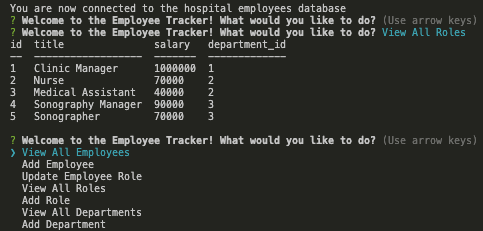

# :clipboard: Employee Tracker :clipboard:

## Table of Contents

* [Description](#description)
* [Screenshots](#screenshots)
* [Usage](#usage)
* [License](#license)

## Description

The Employee Tracker utilizes Mysql2 and Express in Node.js to give the user a series of prompts about how they'd like to view or edit their Employee database. 

## Screenshots

  

## Video Walkthrough

[Video Walkthrough](https://drive.google.com/file/d/1I7m2AvAscdkU8jfsbctQH0EniOxzuj00/view)

## Usage

`npm i` to install dependencies.

`node index.js` to begin questionnaire. 

## License 

[MIT License](https://opensource.org/licenses/MIT)